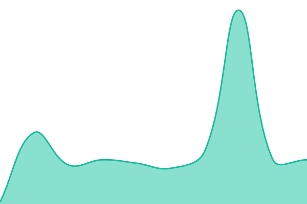
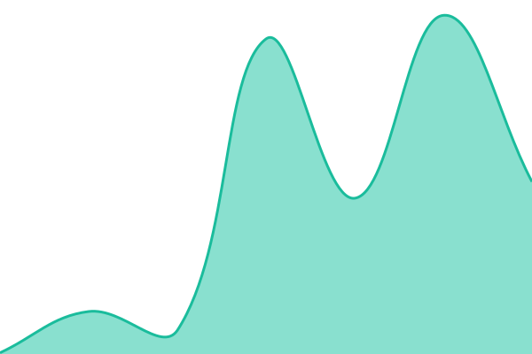
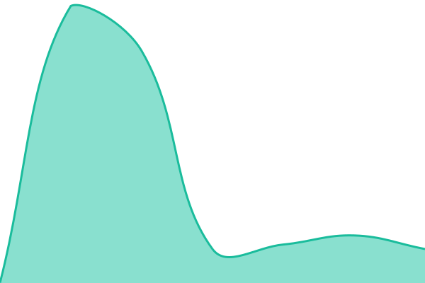
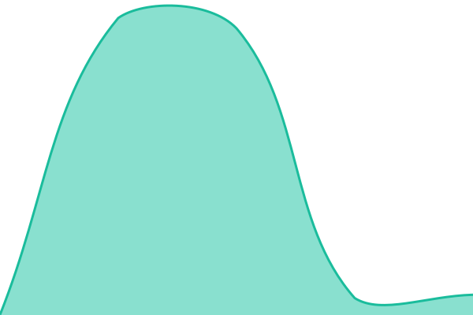
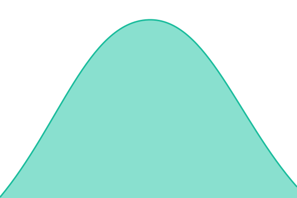

# [📈 Live Status](https://RovxBot.github.io/homelab-uptime): <!--live status--> **🟩 All systems operational**

This repository contains the open-source uptime monitor and status page for [Rov](https://RovxBot.github.io/homelab-uptime), powered by [Upptime](https://github.com/upptime/upptime).

With [Upptime](https://upptime.js.org), you can get your own unlimited and free uptime monitor and status page, powered entirely by a GitHub repository. We use [Issues](https://github.com/RovxBot/homelab-uptime/issues) as incident reports, [Actions](https://github.com/RovxBot/homelab-uptime/actions) as uptime monitors, and [Pages](https://RovxBot.github.io/homelab-uptime) for the status page.

<!--start: status pages-->
<!-- This summary is generated by Upptime (https://github.com/upptime/upptime) -->
<!-- Do not edit this manually, your changes will be overwritten -->
<!-- prettier-ignore -->
| URL | Status | History | Response Time | Uptime |
| --- | ------ | ------- | ------------- | ------ |
|  [Homepage](https://homepage.cooked.beer) | 🟩 Up | [homepage.yml](https://github.com/RovxBot/homelab-uptime/commits/HEAD/history/homepage.yml) | 

 107ms
     
 | 

<a href="https://RovxBot.github.io/homelab-uptime/history/homepage">99.87%</a>
    

|  [Vaultwarden](https://vault.cooked.beer) | 🟩 Up | [vaultwarden.yml](https://github.com/RovxBot/homelab-uptime/commits/HEAD/history/vaultwarden.yml) | 

 134ms
     
 | 

<a href="https://RovxBot.github.io/homelab-uptime/history/vaultwarden">99.87%</a>
    

|  [Radarr](https://radarr.cooked.beer) | 🟩 Up | [radarr.yml](https://github.com/RovxBot/homelab-uptime/commits/HEAD/history/radarr.yml) | 

 83ms
     
 | 

<a href="https://RovxBot.github.io/homelab-uptime/history/radarr">99.87%</a>
    

|  [Sonarr](https://sonarr.cooked.beer) | 🟩 Up | [sonarr.yml](https://github.com/RovxBot/homelab-uptime/commits/HEAD/history/sonarr.yml) | 

 27ms
     
 | 

<a href="https://RovxBot.github.io/homelab-uptime/history/sonarr">99.88%</a>
    

|  [Prowlarr](https://prowlarr.cooked.beer) | 🟩 Up | [prowlarr.yml](https://github.com/RovxBot/homelab-uptime/commits/HEAD/history/prowlarr.yml) | 

 38ms
     
 | 

<a href="https://RovxBot.github.io/homelab-uptime/history/prowlarr">99.88%</a>
    

|  [SABnzbd](https://sabnzbd.cooked.beer) | 🟩 Up | [sa-bnzbd.yml](https://github.com/RovxBot/homelab-uptime/commits/HEAD/history/sa-bnzbd.yml) | 

 72ms
     
 | 

<a href="https://RovxBot.github.io/homelab-uptime/history/sa-bnzbd">99.89%</a>
    

|  [Jellyseerr](https://jellyseerr.cooked.beer) | 🟩 Up | [jellyseerr.yml](https://github.com/RovxBot/homelab-uptime/commits/HEAD/history/jellyseerr.yml) | 

 139ms
     
 | 

<a href="https://RovxBot.github.io/homelab-uptime/history/jellyseerr">99.89%</a>
    

|  [Grimguzzler Registration](https://grimguzzler.cooked.beer) | 🟩 Up | [grimguzzler-registration.yml](https://github.com/RovxBot/homelab-uptime/commits/HEAD/history/grimguzzler-registration.yml) | 

 287ms
     
 | 

<a href="https://RovxBot.github.io/homelab-uptime/history/grimguzzler-registration">100.00%</a>
    

|  [Invoice Ninja](https://invoice.cooked.beer) | 🟩 Up | [invoice-ninja.yml](https://github.com/RovxBot/homelab-uptime/commits/HEAD/history/invoice-ninja.yml) | 

 261ms
     
 | 

<a href="https://RovxBot.github.io/homelab-uptime/history/invoice-ninja">100.00%</a>
    

|  [Immich](https://immich.cooked.beer) | 🟩 Up | [immich.yml](https://github.com/RovxBot/homelab-uptime/commits/HEAD/history/immich.yml) | 

 391ms
     
 | 

<a href="https://RovxBot.github.io/homelab-uptime/history/immich">100.00%</a>
    

|  [Jellyfin](https://jellyfin.cooked.beer) | 🟩 Up | [jellyfin.yml](https://github.com/RovxBot/homelab-uptime/commits/HEAD/history/jellyfin.yml) | 

 386ms
     
 | 

<a href="https://RovxBot.github.io/homelab-uptime/history/jellyfin">91.49%</a>
    

|  [WotLK Realm](grim.cooked.beer) | 🟩 Up | [wot-lk-realm.yml](https://github.com/RovxBot/homelab-uptime/commits/HEAD/history/wot-lk-realm.yml) | 

 0ms
     
 | 

<a href="https://RovxBot.github.io/homelab-uptime/history/wot-lk-realm">100.00%</a>
    

|  [Status Page](https://rovxbot.github.io/homelab-uptime) | 🟩 Up | [status-page.yml](https://github.com/RovxBot/homelab-uptime/commits/HEAD/history/status-page.yml) | 

 90ms
     
 | 

<a href="https://RovxBot.github.io/homelab-uptime/history/status-page">100.00%</a>
    

<!--end: status pages-->

[**Visit our status website →**](https://RovxBot.github.io/homelab-uptime)

## 📄 License

- Powered by: [Upptime](https://github.com/upptime/upptime)
- Code: [MIT](./LICENSE) © [Anand Chowdhary](https://anandchowdhary.com)
- Data in the `./history` directory: [Open Database License](https://opendatacommons.org/licenses/odbl/1-0/)
